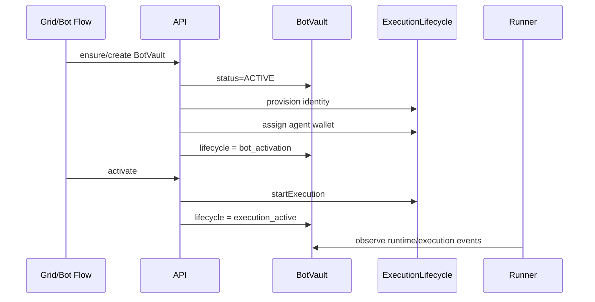

# BotVault Lifecycle

uLiquid Desk treats BotVault lifecycle as an explicit operational model layered on top of persisted status, onchain state, and execution runtime state.

## State Model

- `bot_creation`
  Vault creation is in progress or an onchain `create_bot_vault` action is still pending.
- `bot_activation`
  Vault exists and execution identity is provisioned, but execution is not yet running.
- `execution_active`
  Vault is active and execution is running.
- `paused`
  Vault is paused or in contract `CLOSE_ONLY`; the lifecycle exposes `mode=close_only` to keep that distinction explicit.
- `settling`
  Explicit close workflow is in progress after validation, before terminal close finalization.
- `withdraw_pending`
  A pending onchain claim or close action exists.
- `closed`
  Terminal state.
- `error`
  Execution or lifecycle error that needs operator attention.

## Contract Mapping

- `BotVault.status` remains the contract-compatible source of truth for `ACTIVE`, `PAUSED`, `CLOSE_ONLY`, `CLOSED`, and `ERROR`.
- `BotVault.executionStatus` remains the execution runtime source of truth for `created`, `running`, `paused`, `close_only`, `closed`, and `error`.
- `executionMetadata.lifecycle` stores the normalized operational lifecycle snapshot.
- `executionMetadata.lifecycleOverrideState=settling` is used only for the explicit close window.

## Transition Rules

- `bot_creation -> bot_activation | paused | error`
- `bot_activation -> execution_active | paused | settling | withdraw_pending | error`
- `execution_active -> paused | settling | withdraw_pending | error`
- `paused -> bot_activation | execution_active | settling | withdraw_pending | closed | error`
- `settling -> withdraw_pending | closed | error`
- `withdraw_pending -> execution_active | paused | closed | error`
- `error -> paused | settling | closed`
- `closed -> terminal`

Lifecycle transitions are enforced in API services before status mutations. Contract-state transitions are still validated by `riskPolicyService.assertStatusTransition(...)`.

## Validation And Audit

- `pause`, `activate`, `set_close_only`, and `close` validate both persisted status transition safety and operational lifecycle transition safety.
- Each successful transition emits `vault_lifecycle_transition`.
- Rejected transitions emit `vault_lifecycle_transition_rejected`.
- Execution-side changes still emit `botExecutionEvent` rows for provider/runtime observability.
- `close` emits an explicit transition into `settling` before final settlement and terminal close.

## Failure Handling

- `activate` validates template risk constraints before execution start.
- `close` blocks on active execution or open positions unless `forceClose=true`.
- Failed execution sync or provider failures surface through `executionLastError`, `executionStatus=error`, and execution events.
- Onchain reconciliation normalizes stopped runtime state before comparing with contract state to avoid false drift.

## Admin And Ops Support

Admin support lives under `/admin/vault-operations` and related vault operation routes.

- Read normalized lifecycle snapshots for BotVaults.
- Intervene with sync, pause, activate, close-only, close, and recovery actions.
- Monitor lifecycle state, mode, lag, pending actions, and recent execution issues.

## BotVault Creation And Activation

