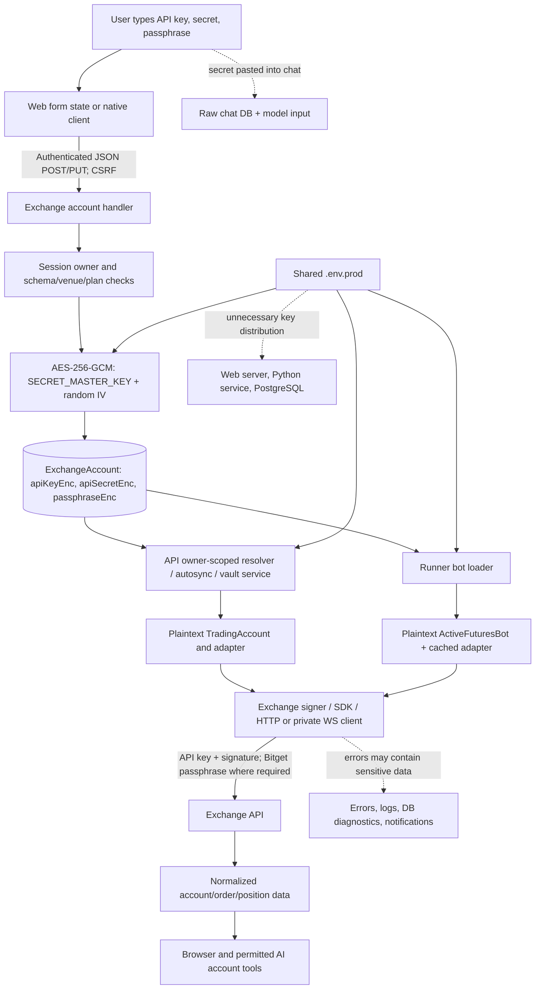

# Focused defensive security audit — uLiquid Desk

Date: 2026-09-12. Audience: Mario and authorized engineering reviewers. Status: assessment complete; remediation not implemented. **Private working report; not a public security advisory.**

## Scope, evidence, and limitations

This audit covers admin backend authorization, stored user exchange credentials, their runtime use, and secret exposure through APIs, logs, errors, WebSockets and AI components. Contract correctness, exchange matching-engine behavior, general infrastructure penetration testing, unrelated billing economics, and dependency CVE scanning are outside scope.

The audit began at `f98b61610400c3ebcf1c20a74590facf0c60175d` on `codex/docs-cleanup`. Two billing files already had unrelated changes. Concurrent work advanced HEAD to `02432d1b285c3907b8b2e599e1f6376a224ac176`; its changes concern receipt-time billing activation and associated UI/docs. The admin guards, credential handling and execution findings below were unchanged by that work. The audit did not modify production code, existing tests, deployment configuration, accounts, permissions, or live data. Only this report directory was created.

Evidence consists of source tracing, a TypeScript AST inventory, targeted existing tests, and synthetic local probes. **142 concrete privileged HTTP endpoints, 34 additional mixed user/admin endpoints, 48 admin pages, and 97 decryption/order/action call sites** are inventoried. Three dynamically registered treasury routes were expanded explicitly. The number of call sites is an inventory metric, not the number of independent trading flows. Background dispatchers appear below. No real credential values, environment file contents, database rows, session tokens, or production log contents were retrieved for this report.

No production endpoint, credential, trade, withdrawal, or LLM request was exercised. Findings marked reproduced refer to local code with synthetic identities, secrets, and mock execution. The normal HTTP authentication layer is established by source tracing; the isolated queue-handler probe deliberately starts after authentication and does not claim a complete HTTP session test. Imported packages can resolve locally built `dist` files, so local tests are not proof of the deployed image. Source fingerprints are provided separately.

Attempts to verify current exchange permission documentation failed because the web tool transport and direct HTTPS requests were unavailable. The report therefore distinguishes the permissions required by Desk's observed operations from **unverified, venue-specific permission-introspection contracts**. It does not claim that a particular venue currently exposes a tested rejection API.

Artifacts:

- [Admin authorization matrix](ADMIN-AUTHORIZATION-MATRIX.md): every enumerated privileged endpoint, effective gate, enforcement location, client authority, object scope, direct normal-user access and session behavior.
- [Additional authorization matrix](ADDITIONAL-AUTHORIZATION-MATRIX.md): 34 individual mixed user/admin endpoints, including provider diagnostics, AI service methods and protected self-service actions.
- [Privileged action inventory](PRIVILEGED-ACTIONS.md): every enumerated handler's direct service, configuration, Prisma and response-helper calls.
- [Execution and secret inventory](EXECUTION-AND-SECRET-INVENTORY.md): exact call sites and all admin page routes.
- [Synthetic probe harness](synthetic-probes.ts), [synthetic results](synthetic-probe-results.json), [validation summary](validation-summary.txt), and [source fingerprints](source-fingerprints.json).

## Findings overview

| Severity | Findings |
|---|---|
| CRITICAL | None established within the assessed evidence. This is not a proof of absence. |
| HIGH | H-01 mobile trading authorization; H-02 permission/handler disagreement; H-03 master-key distribution; H-04 stale credential adapters; H-05 manual execution guardrails; H-06 excessive exchange-key permissions. |
| MEDIUM | M-01 runtime revocation fence; M-02 secret-bearing diagnostics; M-03 master-key rotation; M-04 WebSocket authorization lifetime; M-05 AI message secrecy; M-06 privileged-action reauthentication; M-07 ciphertext context binding. |
| LOW | L-01 admin queue metrics; L-02 legacy plaintext credential schema; L-03 Telegram token returned to admin browser. |
| INFORMATIONAL | I-01 effective protections and remaining plaintext trust boundary. |

Severity describes realistic impact under the stated prerequisite. Conditional leakage and legacy-schema observations are explicitly separated from demonstrated plaintext disclosure of a real user's exchange credentials.

## CRITICAL

No critical finding was established. No unauthenticated exchange-secret retrieval or unauthenticated live-order path was demonstrated.

## HIGH

### H-01 — Mobile trading skips workspace trading permissions

- **Exact files/functions:** `apps/api/src/auth/permissions.ts:34`, `resolvePermissionRequirementForRequest`; `apps/api/src/auth.ts:145`, `requireAuth`; `apps/api/src/mobile/tradingRoutes.ts:403`, `registerMobileTradingRoutes`, particularly POST `/mobile/trading/orders` at line 552 and its cancel/position-management handlers.
- **Code path:** mobile route → `auth = requireAuth` → central request-permission resolver returns `null` for `/mobile/*` → no permission lookup/denial → `resolveMarketDataTradingAccount(user.id, accountId)` → spot client or perpetual execution service.
- **Attack prerequisite:** a valid user session with an owned live exchange account and an exchange key that can trade, but without the corresponding Desk trading permission. CSRF and idempotency requirements still apply. The attacker need not use the mobile app.
- **Realistic impact:** a restricted user can submit trades or alter/cancel existing orders and position protection through the mobile API. This is a permission bypass within their owned account, not a demonstrated cross-user account takeover.
- **Evidence:** synthetic permission probes for mobile order and position paths return no requirement even with an empty permission set. The mounted mobile middleware at `index.ts:837` sanitizes input, normalizes errors, monitors failures and rate-limits; it adds no trading authorization. Ownership is still checked in `trading.ts:1111`.
- **Recommended remediation:** attach explicit action permissions to every mobile handler and enforce them again at the execution service boundary using the canonical validated intent. Share this policy with web execution and add negative tests for restricted roles on every mobile mutation.

### H-02 — Raw URL and body aliases disagree with the executed action

- **Exact files/functions:** `apps/api/src/auth/permissions.ts:7`, `cleanPath`; line 12, `orderPermissionFromBody`; line 34, `resolvePermissionRequirementForRequest`; `apps/api/src/manual-trading/routes-execution.ts:43`, `placeOrderSchema`, and line 361, POST `/api/orders`; `apps/api/src/server/appMiddleware.ts:153`, `configureApiBaseMiddleware`.
- **Code path:** `requireAuth` classifies `req.originalUrl` and unvalidated `req.body`; the handler later parses a different canonical schema. The permission function prefers `orderType` over `type`, while web execution uses only validated `type`. Express routing is case-insensitive by default, but the permission map uses case-sensitive string matching.
- **Attack prerequisite:** a valid restricted session and an owned trading account; for the body-alias case, limit-order permission without market-order permission. For case variants, the caller still needs authentication and any independent handler checks.
- **Realistic impact:** a body containing conflicting `orderType` and `type` can authorize one order class and execute another. A case variant of an existing route can bypass the mapped permission entirely, including exchange-key edit permission. Explicit P/B admin checks remain effective; this is not an admin-role bypass.
- **Evidence:** a synthetic `{orderType: "limit", type: "market"}` is authorized by `trading.manual_limit`; the route schema strips the unused alias and executes `type`. An isolated Express route matches `/API/ORDERS`, while the permission resolver returns `null` for that path. No case-sensitive-routing setting was found.
- **Recommended remediation:** declare authorization next to the registered route, parse once, authorize the resulting typed command and use that same command for execution. Deny unclassified sensitive actions. Do not try to fix this solely by adding more raw URL aliases.

### H-03 — The production master key is distributed to unnecessary services

- **Exact files/functions:** `docker-compose.prod.yml:19,43,162,203,233`, service `env_file` blocks; `scripts/install_vps.sh:147,280`, installation/env persistence; `apps/api/src/secret-crypto.ts:13`, `resolveMasterKey`; `apps/runner/src/secret-crypto.ts:16`, `resolveMasterKey`.
- **Code path:** installer stores `SECRET_MASTER_KEY` in `.env.prod` → Compose injects the complete file into PostgreSQL, API, Python strategy service, web and runner → any process with that environment and ciphertext can implement the same AES decryption.
- **Attack prerequisite:** compromise of one of those process/container environments plus access to the ciphertext. The shared file also distributes database configuration according to deployment contents; actual runtime values/roles were not inspected.
- **Realistic impact:** compromise of a non-execution service can defeat encryption-at-rest for all users' exchange secrets. Database **server/container** compromise can also expose the key from its environment, defeating the intended separation between database and key custody.
- **Evidence:** five `.env.prod` mounts in the supplied production Compose configuration; no separate exchange-credential decryption identity, KMS permission or signing-only service. This is deployment-source evidence, not an inspection of running containers.
- **Recommended remediation:** use explicit per-service environment allowlists. Keep the credential encryption authority outside the DB/web/Python/AI processes. Prefer a dedicated exchange execution/signing service backed by a managed key service and narrowly scoped workload identities. API admission may encrypt without granting general plaintext export.

### H-04 — Runner adapters keep old exchange credentials after rotation

- **Exact files/functions:** `apps/runner/src/execution/futuresVenueRuntime.ts:22,294`, `adapterCache` / `getOrCreateRunnerFuturesAdapter`; `simpleExecutionMode.ts:162`, `buildLiveAdapter`; `futuresGridExecutionMode.ts:1024`, `getOrCreateAdapterForBot`; `apps/runner/src/prediction-copier.ts:867`; `apps/api/src/exchange-accounts/routes.ts:802`, account update handler.
- **Code path:** reload changed credentials from DB → request adapter using `botId:exchangeAccountId` → return the existing adapter before comparing credentials → subsequent orders still use the old key/secret/passphrase. No eviction or TTL was found in this adapter cache.
- **Attack prerequisite:** an existing runner adapter and an account credential replacement. Continued successful trading requires the old key to remain valid at the exchange; after venue revocation, the likely result is authentication failure instead.
- **Realistic impact:** rotation in Desk does not reliably switch execution identity or terminate the old secret's memory lifetime. An incident-response rotation can leave the old key active in-process; independent venue revocation can break bots until the adapter is recreated.
- **Evidence:** a local probe supplies two different synthetic credential sets with the same cache key and receives the identical adapter object. No exchange request is made. Versioned BotVault agent identities have a separate cache scope and must not be confused with the ordinary user exchange-account cache.
- **Recommended remediation:** key caches by account ID plus immutable credential version and execution identity; explicitly close and evict old adapters on rotation, disable/delete and bot teardown. Never key caches by plaintext. Validate the version again immediately before signing/submission.

### H-05 — Manual spot/perpetual orders bypass shared global trading/risk guards

- **Exact files/functions:** `apps/api/src/manual-trading/routes-execution.ts:361,414,430`, order handler; `apps/api/src/mobile/tradingRoutes.ts:552,596,619`; `apps/api/src/execution/perp-execution-service.ts:304`, returned `placeOrder`; `packages/futures-engine/src/executionFoundation.ts:393`, `executeSharedExecutionPipeline`; `packages/futures-engine/src/engine.ts:81`, `isGlobalTradingEnabled`.
- **Code path:** manual spot handler calls `spotClient.placeOrder` directly. Manual perpetual handler calls the shared pipeline without its optional `guard`; its `execute` callback calls the adapter. Venue eligibility, precision, sizing and exchange responses are not Desk user/account risk authorization.
- **Attack prerequisite:** an authorized or H-01/H-02-bypassing manual trader and a live trading key while operators believe a global halt or configured trading-risk policy prevents new exposure.
- **Realistic impact:** manual orders can create exposure despite `GLOBAL_TRADING_ENABLED=false` / the separate global-disable convention used elsewhere. No account daily-loss/exposure guard is supplied at this service boundary. Exchange-level balance and order validation still apply.
- **Evidence:** an isolated `createPerpExecutionService` probe with both global-disable flags set still invokes its mock adapter's order method. The runner's simple engine uses `isGlobalTradingEnabled`; the manual service does not. The generic pipeline only invokes guardrails when a guard is supplied.
- **Recommended remediation:** centralize an obligatory final execution guard for manual, mobile, bot, grid, replacement and close paths. It must distinguish new exposure from authorized reduce-only recovery, enforce a single authoritative kill-switch policy, check account/bot state and risk limits, and fail closed when required policy state is unavailable.

### H-06 — Credential admission never proves or rejects withdrawal/transfer privileges

- **Exact files/functions:** `apps/api/src/exchange-accounts/routes.ts:18,693,802,967`, input schemas and create/update/test-connection handlers; `apps/api/src/index.ts:7265`, `executeExchangeSync`; `apps/api/src/exchange-sync.ts`, `syncExchangeAccount`; `packages/futures-exchange/src/core/exchange-capabilities.ts`, venue capability constants.
- **Code path:** structurally valid credential input → encrypt/store. Optional connection testing reads account data. No authoritative API-key permission inventory, excessive-permission rejection, permission snapshot/expiry, or permission attestation is persisted. Static venue capabilities describe adapter features, not the permissions of a user's key.
- **Attack prerequisite:** a user connects an overprivileged key, then that key or a plaintext-capable workload is compromised. A live attacker does not gain withdrawal capability merely by passing Desk's login.
- **Realistic impact:** compromise may extend beyond read/trade loss to transfer or withdrawal where the venue permits it. Hyperliquid input accepts a syntactically valid private key without enforcing that it is a limited agent identity; a main-account key has a different risk boundary. No withdrawal using a real credential was attempted or demonstrated.
- **Evidence:** the create/update handlers perform schema, exchange feature, ownership and plan checks but have no permission-introspection step. The ExchangeAccount model has no permission fields. `getHyperliquidAccountSetupHint` reads a role for a setup hint, not an admission rejection of unrestricted keys.
- **Recommended remediation:** implement per-venue permission validation at admission, rotation and periodically thereafter. Require read-only keys for account-read-only mode and only product-specific trade permissions for execution. Reject withdraw/transfer/admin authority for ordinary trading credentials where it can be authoritatively detected; otherwise record `unknown` and require a separate documented admission policy. Separate funding identities from trading identities. Do not claim a connection test proves safe key scopes.

## MEDIUM

### M-01 — No complete authorization/revocation fence immediately before submission

- **Exact files/functions:** `prisma/schema.prisma:395`, `ExchangeAccount`; `apps/runner/src/db.ts:1356,1390,1431`, `mapRowToActiveBot`, `canExecuteRow`, `loadBotForExecution`; `apps/runner/src/index.ts:172`, `processRunBotJob`; `apps/runner/src/loop.ts:578,634`; `apps/runner/src/execution/futuresGridExecutionMode.ts:3123,4289`; `apps/api/src/exchange-accounts/routes.ts:935`, deletion.
- **Code path:** queue job contains bot ID → worker checks bot status and loads/decrypts the row → signal/planning/network waits → submits through adapter. There is no final credential-version/role/owner/account-active assertion tied atomically to that submission. The execution relation does not select/recompare `exchangeAccount.userId`. ExchangeAccount has no disabled/revoked/active state to check.
- **Attack prerequisite:** a stop, role removal, credential change or account deletion races with in-flight work, or a privileged writer corrupts a bot/account association. No cross-user association-write endpoint was established.
- **Impact:** one in-flight execution cycle can outlive its authorization state; removal of trading permissions does not by itself stop running bots. There is no defensible promise of immediate local revocation.
- **Evidence and limits:** ordinary queued work checks `status === running` before every loop and reloads account data. Deleted/incomplete bots stop. API deletion rejects any linked bot and paper dependencies. Thus a merely queued job is **not** proven to continue indefinitely after deletion. Existing adapters/in-flight calls and WebSocket polling are the remaining windows. Grid funding/readiness/risk checks are present but are not a user/credential revocation fence.
- **Remediation:** persist account state and credential version; issue revocable execution grants bound to user/account/bot and policy version. Recheck/fence each order, propagate stop/revocation events, cancel pending work, and specify a bounded cancellation SLA. Preserve explicit close-only recovery authority.

### M-02 — Secret-bearing errors can reach browser responses, logs, DB diagnostics and notifications

- **Exact files/functions:** `apps/api/src/manual-trading-error.ts:162`, `buildManualTradingErrorResponse`; `apps/api/src/index.ts:11157,11187`, `summarizeManualTradingErrorDetails`, `sendManualTradingError`; `index.ts:6986,7236`, `normalizeSyncErrorMessage`, `persistExchangeSyncFailure`; `apps/api/src/logger.ts:3`, `log`; `apps/runner/src/logger.ts:2`; `packages/futures-exchange/src/bitget/bitget.rest.ts:109`, `doRequest`; `apps/api/src/ai/traceLog.ts:234`, `recordAiTraceLog` error field; `apps/api/src/ai/agent-chat/errors.ts:34`, `toAgentChatError`.
- **Code path:** upstream error/SDK exception → raw `message` or provider response body → manual JSON response and console output; manual messages also enter notification dispatch. Sync messages are truncated, not redacted, and returned by account listing. AI trace payloads are sanitized, but `input.error` is only truncated. Agent Chat's generic error fallback preserves its message.
- **Attack prerequisite:** an exception contains a secret, authentication header, provider-echoed key or sensitive request diagnostics, and an attacker can read the resulting response/log/notification/trace. Real exchanges do not normally receive HMAC secrets, so an upstream echo alone does not prove exposure of those secrets.
- **Impact:** avoidable secret persistence and secondary disclosure through observability and support/admin surfaces. This is a demonstrated failure of the output boundary, not evidence of an actual historical credential leak.
- **Evidence:** a synthetic `Error` containing a marked fake secret survives `buildManualTradingErrorResponse`. The two main loggers have no mandatory redactor. Manual diagnostics explicitly retain Bitget/BingX response bodies. `redactProviderDiagnostics` exists but is not applied at these sinks; AI redaction is partial and local.
- **Remediation:** replace public errors with stable codes and safe messages; centrally redact log metadata and string content before serialization; allowlist provider diagnostic fields. Sanitize persisted error fields, notifications and AI errors too. Add canary tests covering nested errors, strings, provider bodies, query strings and every sink. Any historical search should report only counts/locations, never values.

### M-03 — Encryption has no managed master-key rotation or key identifier

- **Exact files/functions:** `apps/api/src/secret-crypto.ts:31,46`, `encryptSecret`, `decryptSecretWithKey`; `apps/runner/src/secret-crypto.ts:31,46`; `prisma/schema.prisma:402`.
- **Code path:** all exchange fields use the single current `SECRET_MASTER_KEY`; the stored `v1` token identifies the envelope format, not a key version. Changing the env key makes existing ciphertext unreadable.
- **Prerequisite:** key compromise, scheduled key rotation or deployment configuration error.
- **Impact:** recovery requires a coordinated bulk re-encryption procedure and cache invalidation; simply replacing the key can disable exchange access. The per-account `credentialsRotatedAt` timestamp is not master-key rotation, and is maintained specifically for Hyperliquid expiry tracking.
- **Evidence:** no keyring/KEK ID, dual-read transition or credential re-encryption migration was found in the assessed code/scripts. Agent-secret versioning concerns signing identities, not the ordinary exchange encryption key.
- **Remediation:** introduce a key-ID envelope and managed key rotation with verified staged rewrap/re-encryption, rollback, job fencing and restart/eviction rules. Keep old key material only for a bounded migration window.

### M-04 — Private WebSockets retain authorization and credentials beyond session revocation

- **Exact files/functions:** `apps/api/src/server/websocketUpgrade.ts:65,106`, `authenticateWsUser`, `registerApiWebSocketUpgrades`; `apps/api/src/index.ts:13204`, `handleUserWsConnection`, especially closure/polling setup around 13264–13310.
- **Code path:** validate session at upgrade → resolve owned exchange account once → retain clients/credentials and poll or subscribe until socket cleanup. No current-role check, idle-expiry check matching HTTP, periodic session lookup or revocation-triggered socket close was found.
- **Prerequisite:** a socket established before logout/session removal, role reduction, or local account removal/credential rotation. Venue credentials must remain valid for continued private reads.
- **Impact:** continued access to private account/position/order data and a longer plaintext lifetime. No WebSocket order-submission command was found; the established impact is read access, not trading.
- **Evidence:** upgrade authentication checks absolute expiry and updates activity only once; the recurring account-summary closure captures the resolved account. Cleanup responds to socket lifecycle, not session/account revocation.
- **Remediation:** authorize private streams explicitly, bind them to session/account/credential versions, terminate on revocation and periodically revalidate with a bounded lifetime. Add Origin validation as a separate defense; browser cookie behavior and proxy policy were not live-tested.

### M-05 — Secrets pasted into AI chat are persisted and may be sent to the model

- **Exact files/functions:** `apps/api/src/ai/agent-chat/service.ts:349,361`, `AgentChatService.sendMessage`; `apps/api/src/ai/agent-chat/runtime.ts:253,283`, `runAgentChat`; `apps/api/src/ai/safety/toolPolicy.ts:260`, `redactSecretText`; `apps/api/src/ai/traceLog.ts:200`, `recordAiTraceLog`.
- **Code path:** user message → `AiAgentMessage.content` unchanged → permitted trading-context chat and prior history → `callAiChat`. Trace snapshots being redacted does not sanitize the original message or outbound request. Even out-of-scope messages are stored before the scope-guard response.
- **Prerequisite:** a user pastes credentials into a trading-related message/history, or another component inserts them into free text. This is not an established automatic path from ExchangeAccount decryption to an LLM prompt.
- **Impact:** raw chat storage/browser history can retain secrets; in-scope content can disclose them to the model provider. A generic hex private key or unlabeled exchange secret is not reliably recognized by the current text redactor.
- **Evidence:** raw `content` is written at service line 349; raw `params.userMessage` and history enter messages at runtime line 253. AI account tools use owned metadata/normalized projections and strip raw orders; known structured secret fields are redacted successfully in the local probe.
- **Remediation:** reject or sanitize secret-bearing input before persistence and before every model call, including history, tool errors and imported context. Keep secret-handling objects structurally inaccessible to prompt builders. Add explicit “never paste credentials” UX and deterministic coverage of labeled and unlabeled common credential formats without logging matches.

### M-06 — Several high-impact admin actions require only an existing privileged session

- **Exact files/functions:** `apps/api/src/admin/routes-operations.ts:218,255,383`, password reset, backend-access mutation and user deletion; `apps/api/src/admin/routes-vault-operations.ts:95,529,592`, execution mode, safety settings and `intervene`; all in their `registerAdmin*Routes` functions.
- **Code path:** session → platform-superadmin gate → privileged mutation. Unlike selected ULIQ actions, billing enable/payment-config changes, and mounted close-only-all, these handlers do not consume recent reauthentication.
- **Prerequisite:** theft/misuse of a still-valid platform-superadmin session. Normal authenticated users cannot pass the route gate.
- **Impact:** that session can reset another account's password, grant backend access, delete a user, change safety controls or perform lifecycle interventions without a fresh proof of operator presence. Password reset also creates a path to act as a user, even though there is no exchange-secret export endpoint.
- **Evidence:** concrete handler chains and index wiring in the matrix. Password reset revokes the target's sessions; that protects the target's previous sessions but does not add step-up protection for the admin action.
- **Remediation:** apply action-specific, short-lived reauthentication to account takeover, privilege grant, destructive and execution-control actions. Bind approval to actor, action, target and payload; keep recovery paths usable and audited.

### M-07 — Ciphertexts are not bound to their tenant, account or field

- **Exact files/functions:** `apps/api/src/secret-crypto.ts:31,46`, encryption/decryption; `apps/runner/src/secret-crypto.ts:31`; `apps/api/src/trading.ts:1177`, `resolveTradingAccount`.
- **Code path:** AES-GCM authenticates only the ciphertext under the shared key. No `setAAD` binds user ID, exchange-account ID, exchange, field or schema/key version.
- **Prerequisite:** an attacker can read and write credential ciphertext rows or another trusted database writer misassigns them. This is not a read-only DB-compromise attack; a broad DB writer already has substantial power over the application.
- **Impact:** copying a valid credential set into another account row does not trigger a cryptographic context error. Desk can then act as a signing/decryption consumer for the substituted identity. Other relational tampering remains possible even after fixing AAD.
- **Evidence:** the encrypt/decrypt functions accept only plaintext/ciphertext and key, with no context parameters; AES-GCM's tag verifies after a valid envelope is moved intact.
- **Remediation:** authenticate stable tenant/account/field context as AAD and verify it in the execution service; combine with database least privilege, binding validation and revocable execution grants. Treat AAD as defense in depth, not protection against arbitrary database takeover.

## LOW

### L-01 — `/admin/queue/metrics` is available to every authenticated user

- **Exact files/functions:** `apps/api/src/system/routes.ts:85`, `registerSystemRoutes`; `apps/api/src/orchestration.ts:237`, `getQueueMetrics`; `apps/api/src/auth/permissions.ts:45`.
- **Code path:** `requireAuth` → queue counts; the generic permission map deliberately excludes admin routes, and this handler omits the independent admin guard.
- **Prerequisite:** any valid session.
- **Impact:** global queue mode/counts are exposed; failure responses also include `String(error)`. The successful response contains aggregate counts, not job payloads or exchange credentials. Severity is limited accordingly.
- **Evidence:** synthetic authenticated handler returns 200 while a denying admin checker is never called. Neighboring health/license routes call that checker.
- **Remediation:** enforce the intended P/B gate inside the handler and return a stable sanitized failure code. Add a negative normal-user test.

### L-02 — Legacy schema still permits plaintext exchange credentials

- **Exact files/functions:** `prisma/schema.prisma:693`, `CexConfig` model (`apiKey`, `apiSecret`, `apiMemo`); `prisma/migrations/20260113115730_mm_min_max_order/migration.sql:82`, table creation. No active service function referencing this model was found.
- **Code path:** legacy database columns, not the current ExchangeAccount create/update path.
- **Prerequisite:** historical rows/backups actually contain secrets, plus database-read access.
- **Impact:** those legacy values would be readable without `SECRET_MASTER_KEY`. **Population is unresolved**; the schema alone is not evidence that production stores any current key there.
- **Evidence:** source-wide model-reference search found the schema/migration and no current API/runner consumer.
- **Remediation:** inspect only counts and secret-presence booleans under a separate read-only data review; migrate or remove obsolete credentials and rotate affected exchange keys if present. Include retained backups in the cleanup plan.

### L-03 — Legacy alert settings return the Telegram bot token to a superadmin browser

- **Exact files/functions:** `apps/api/src/settings/routes-core.ts:205,235,672,681,800`, `buildAlertsResponse` and alert GET/PUT handlers; `prisma/schema.prisma:704`, `AlertConfig`; `apps/api/src/admin/routes-operations.ts:459`, contrasting masked admin response.
- **Code path:** stored `AlertConfig.telegramBotToken` → `telegramBotToken` response for a server-confirmed superadmin. Ordinary users receive null.
- **Prerequisite:** a platform-superadmin session or read access to that plaintext DB field.
- **Impact:** a shared messaging secret reaches a browser and expands exposure via session compromise or browser tooling. This is a Telegram secret, not an exchange credential.
- **Evidence:** the older settings path returns the token, whereas `/admin/settings/telegram` returns only a mask.
- **Remediation:** keep settings responses write-only/presence-only, mask consistently, encrypt the stored token with separate custody, and review consumers before removing the legacy field.

## INFORMATIONAL

### I-01 — Current encrypted storage and endpoint ownership provide useful protection, with a broad in-process trust boundary

- **Files/functions:** `apps/api/src/secret-crypto.ts:31,46`; `apps/api/src/exchange-accounts/routes.ts:585,693,802,935,967`; `apps/api/src/trading.ts:1111`; `apps/api/src/ai/agent-chat/skills.ts:294,311,585,662`; `apps/runner/src/plugins/loader.ts:91`, `initializeRunnerPlugins`; `apps/runner/src/signal/types.ts:17` / `execution/types.ts:25`.
- **Path/evidence:** AES-256-GCM uses a fresh 12-byte random IV and an authentication tag. Synthetic roundtrip, nonce variation and tamper rejection passed. Current exchange responses are constructed DTOs with masked API keys and no secret field. Ordinary account reads/updates/deletes resolve `id + userId` from the authenticated session. Runtime plugins execute in-process and receive a bot object containing plaintext credentials; module loading is environment-controlled and allowlisted by prefix, not user-uploaded in the audited paths.
- **Prerequisite/impact:** a read-only database dump of the current encrypted fields, without a key or plaintext side channel, does not directly expose their values. API/runner process compromise, trusted plugins, debuggers and heap/core dumps can see plaintext. Ordinary platform admins do not have a dedicated exchange-secret retrieval route; machine operators with key and DB access can decrypt.
- **Recommended action:** preserve the working storage/ownership controls and DTO projections. Split signal/planning plugins from credential custody; passing a read/trade capability or opaque execution grant is preferable to passing a credential-bearing bot object.

## Exchange credential data flow



HMAC exchange secrets are normally used locally to compute signatures; they are not intentionally transmitted to the exchange as plaintext. The API key is sent as authentication metadata. Bitget signing uses key, secret and passphrase; Hyperliquid signing uses a private key held by its SDK/wallet client. Venue TLS/base URLs come from adapter configuration/environment. Runtime egress/TLS enforcement, proxies and redirects were not live-verified.

### Storage and key custody

| Storage | Contents and protection | Audit conclusion |
|---|---|---|
| `ExchangeAccount.apiKeyEnc`, `.apiSecretEnc`, `.passphraseEnc` (`schema.prisma:402–404`) | Separate `v1.base64(iv).base64(tag).base64(ciphertext)` AES-GCM envelopes | Current user exchange credentials. For Hyperliquid, fields represent signer/address, private key, and optional account/vault address respectively. |
| `AgentWalletSecret.encryptedPrivateKey` (`schema.prisma:1923`) | Same encryption helpers for generated agent keys; providers can use `AGENT_SECRET_ENCRYPTION_KEY` with master-key fallback | Execution signing secrets in adjacent Hyperliquid flows; includes user-agent and affiliate-wallet identities, not only ordinary CEX API keys. |
| `CexConfig.apiKey`, `.apiSecret`, `.apiMemo` (`schema.prisma:696–698`) | Plain String columns | Legacy; no current code consumer; production population unknown. |
| `GlobalSetting.value` | JSON, including encrypted AI/SMTP fields, policy and runtime state | Not a dedicated ordinary exchange-key store. Free-form metadata/errors remain possible secondary leakage sinks. |
| `AiAgentMessage.content`, `AiTraceLog.error`, exchange sync/runtime/error/event fields | Plaintext content/diagnostics | Can become accidental secret stores; see M-02/M-05. |
| Environment maps `HYPERLIQUID_AGENT_SECRETS_JSON` / `HYPERLIQUID_AGENT_SECRETS_ENCRYPTED_JSON` | Supported plaintext/encrypted fallback signing identities | Provider selection is deployment-controlled; actual use was not inspected. Maps are retained in provider closures. |

`SECRET_MASTER_KEY` accepts 32 raw characters interpreted as UTF-8, 64 hex characters, or base64 that decodes to 32 bytes. Random-IV authenticated encryption is sound for valid random key material; length/encoding validation alone does not establish entropy. Missing keys cause failure rather than a default production key. No file containing actual key material was opened.

For a **read-only dump**, current encrypted ExchangeAccount rows require the key. For **DB server/container compromise**, the supplied Compose arrangement also exposes the key environment. For **DB write compromise**, relational and ciphertext substitution attacks are possible even without learning the key. Legacy/plain diagnostic rows need separate evaluation. These are different threat models.

Agent identity versions/ref/status are supported, and active DB agent rows are selected in `vaults/agentSecretProvider.ts:208` and runner counterpart `execution/agentSecretProvider.ts:211`. DB lookup failures fall back to configured maps. This fallback must be included in revocation design. An additional unresolved configuration question is the separate agent encryption key: generated DB secrets use `encryptSecret` (master key) at `botVaultV3.service.ts:6289`, while readers prefer `AGENT_SECRET_ENCRYPTION_KEY`. Deployments with different key values need an explicit envelope/key-selection migration; no such configuration was assumed here.

### Every identified plaintext-capable component

The call-site annex gives individual decrypt operations, including API and runner generic crypto helpers and their alternate-key variants. Components below distinguish intended plaintext consumers from workloads that merely possess enough authority to obtain it.

| Component | Exact source/function | Plaintext visibility and lifetime |
|---|---|---|
| Web credential entry | `apps/web/app/settings/exchange-accounts/page.tsx:113,189,234`, form state / createAccount / save edit handler; `apps/web/lib/api.ts`, API helpers | User-entered strings and serialized JSON until cleared/GC; successful create clears state; edit starts empty. No exchange-secret local/session-storage persistence found. Browser input is inherently visible to the user's browser/extensions. |
| API ingress | `server/appMiddleware.ts:183`, JSON parser rawBody capture; `exchange-accounts/routes.ts`, POST/PUT | Both parsed body and a raw JSON-body copy exist in request memory. No intentional exchange request-body logging found. |
| Account list/update | `exchange-accounts/routes.ts:627,843`, callbacks in registerExchangeAccountRoutes | Decrypts key for masking; updates decrypt prior key, secret, passphrase. Hyperliquid address fields can be returned unmasked because they are addresses, not the signing secret. |
| Manual/mobile/account reads | `trading.ts:1111`, resolveTradingAccount; resolveMarketDataTradingAccount | Full TradingAccount object passed to read/execution factories; owner lookup precedes decryption. |
| Autosync/dashboard/prediction market runtimes | `index.ts:7246,7265,7278`, decodeExchangeSecrets / executeExchangeSync / runExchangeAutoSyncCycle; `exchange-sync.ts`, syncExchangeAccount; `perp/perp-market-data.client.ts:814` | API process can decrypt all selected accounts, including for data reads. Returned market/account DTOs do not require secret fields. |
| WebSocket handlers | `index.ts:11109,12818,13204`, context construction and market/user handlers | Resolved account, SDK/client closures retained for socket lifetime; private WS signing/client authentication sees the key material. |
| Runner DB mapping | `apps/runner/src/db.ts:536,1305,1356`, decodeCredentials / resolveMarketDataForBot / mapRowToActiveBot | Full execution and market-data credentials in ActiveFuturesBot. Re-loaded per worker loop / supervisor scan. |
| Runner execution and signal plugins | `loop.ts`; `signal/types.ts`; `plugins/signalSource.ts`; `execution/types.ts`; `plugins/loader.ts` | Signal source, signal engine and execution modes can receive the credential-bearing bot; trusted in-process code has ambient environment/DB authority. |
| Runner cache / copier / grid | `execution/futuresVenueRuntime.ts:22`; simpleExecutionMode; futuresGridExecutionMode; prediction-copier | Adapter object retains strings/SDK state; ordinary cache has no credential-version invalidation. |
| Spot adapters | `apps/api/src/spot/spot-client-factory.ts`, bitget-spot.client.ts, hyperliquid-spot.client.ts; `packages/exchange/src/{binance,bingx,mexc,ccxt}/*.client.ts` | Constructor config, REST signing/SDK objects, and CCXT exchange instance see credentials. Only wired venue paths execute; source availability is not activation evidence. |
| Futures adapters and transports | `packages/futures-exchange/src/{bitget,binance,bingx,mexc,hyperliquid}` adapters, REST/signing/trade clients and private WS; factory/create-futures-adapter.ts | API key/secret/passphrase or wallet key in-process. CCXT perpetual stub is not a demonstrated live execution path. |
| Vault lifecycle closeout | `vaults/botVaultLifecycle.service.ts:154,394`, address resolver / closeout; `vaults/executionProvider.hyperliquid.ts:178`, decodeHyperliquidSecrets | Reads/decrypts owned vault-associated exchange identities for reconciliation/closeout. |
| Vault V3/V4 service runtime | `vaults/botVaultV3.service.ts:3356`, execution account materialization; onchainAction.service.ts:980 | Signer credentials, agent wallet generation and funded-execution paths. onchainAction service decrypt at line 980 reads an address only. |
| Agent secret consumers | API and runner agentSecretProvider; `vaults/service.ts:2586`, fundingVault.service.ts:482, botVaultV3.service.ts:3367,4940,6010,6090,6460; runner botVaultExecutionSupervisor.ts:195 | Private execution/funding keys or references resolved into signing objects. Separate from ordinary CEX permission scope. |
| AI account-tool implementation | `ai/agent-chat/skills.ts:311,323,600`, loadPerpPositions / open-order tool | Server tool implementation resolves plaintext accounts and creates an adapter, but returns normalized owned account data, not the TradingAccount. The LLM itself is not a decryption service. |
| AI provider/SMTP modules | `ai/provider.ts:408`, decryptStoredSecret; `index.ts:3973,4135,4160`; `email.ts:61` | Intended to decrypt their own platform secrets, but same API process/master-key authority can also decrypt exchange ciphertext if obtained. |
| Web server/Python/PostgreSQL, operators/debuggers | `docker-compose.prod.yml` shared env_file blocks | Not identified as intended direct exchange decryption callers; nevertheless receive key authority through configuration. Host/container admins and heap/core-dump readers can see runtime plaintext. |

## Exchange permissions actually needed by Desk's operations

| Desk operation | Minimum functional authority | Does the assessed Desk validate the credential's scope? |
|---|---|---|
| Public tickers/orderbook/candles/contracts | No private key for genuinely public endpoints | Public synthetic accounts exist, but several mixed read factories still accept full credential objects. |
| Private balances, positions, open orders, fills | Account/product read authority; private user-stream authentication where applicable | Connection success can demonstrate a particular read, not safe overall permissions. No persisted scope attestation. |
| Spot buy/sell, cancel, replace | Spot trade authority plus necessary account/order reads | No affirmative key-scope validation; request can fail later at venue. |
| Futures/perpetual entry, exit, cancel, replace, leverage/margin configuration, TP/SL | Appropriate derivatives trading/account authority plus reads and relevant position-setting capability | Venue feature checks exist; they do not inspect a user's permission grant. |
| Ordinary manual/bot trading | Withdrawal/external transfer is not required by the traced ordinary order endpoints | No rejection of excessive withdrawal/transfer authority. |
| Hyperliquid funding/settlement/internal spot-perp transfer paths | Separate funding/operator/signer authority as required by those paths | Must remain separate from the trading-key admission policy. They cannot be described as universally “no transfer required.” |

For Bitget, Binance, BingX and MEXC, the source performs request signing and maps permission-denied responses; it does not introspect all key grants. Hyperliquid has role/setup reads, agent identity/version checks in vault flows, and distinct funding operations; those are not a generic CEX withdrawal-permission validator. Whether each current venue API can reliably detect/reject dangerous permissions remains an explicit open validation item because official documentation could not be reached. Do not translate a balance read or an adapter's `supportsTransfer` value into a key-scope claim.

## Runtime order-path verification

Legend: “entry” means verified earlier in the request/job, not immediately before every exchange submission. “No final fence” means there is no uniform current principal/account/version check at the signer. Intentional exits can run while bots are stopped/close-only; that is not automatically a violation.

| Execution family | Path to submission | Owner/account checks | Account and bot/strategy state | Trading permission/risk/credentials |
|---|---|---|---|---|
| Web manual spot | POST `/api/orders` → resolveMarketDataTradingAccount → createManualSpotClient → placeOrder | Session + account owner at entry | No account active field; bot N/A | Raw-path permission bypass H-02; venue flags/sizing exist; no central Desk risk guard; decrypt at entry. |
| Web manual perp | POST `/api/orders` → createPerpExecutionService.placeOrder → optional-guard pipeline → adapter.placeOrder | Session + account owner at entry | No account active field; bot N/A | H-02/H-05; venue capability/precision/exchange response checks; no final fence. |
| Mobile spot/perp | POST `/mobile/trading/orders` → same factories/services | Session + account owner at entry | Same as manual | Missing Desk trading permission H-01; sizing/venue checks present; same risk gap. |
| Manual/mobile edits, cancels, TP/SL and closes | routes-execution / mobile trading routes → service/adapter; replacement orders can submit new orders; spot close sells balance | Owner account defines exchange order namespace; venue validates order ownership within that key's account | Bot N/A; closing can remain allowed during halt under an explicit policy | Permission map varies by action and is bypassable; no uniform final fence. Inspect all individual calls in annex, not just initial placeOrder. |
| Standard futures bot | bots create/start handler → enqueueBotRun → processRunBotJob → loopOnce → simpleExecutionMode → FuturesEngine → placeNormalizedOrder/placeOrder | HTTP owner checks; worker loads bot by ID and trusts association; no current role proof at signer | running checked each queue loop; futures config and account required; no account active field | Runner global safety, capabilities/signal gates and execution guardrails exist; cached credentials H-04; M-01 remains. |
| Prediction copier | Same lifecycle → prediction-copier signal/entry/exit logic → shared simple execution/FuturesEngine | Prediction lookups are user/account scoped; worker trust as above | Prediction eligibility/staleness/cooldown/state gates present | Not an LLM directly submitting an order; current policy/credential revocation still lacks a final fence. |
| Futures grid | grid start/resume → loop/supervisor → futuresGridExecutionMode → initial seed or planner place/replace helper → adapter | API grid/account ownership checks; worker trusts persisted relations | Grid eligibility, funding readiness, risk-filtered intents, resubmission/reconciliation guards present | Seed at line 3123 and subsequent per-order readiness path around 4289; no universal user/credential version fence. |
| BotVault V3/V4 execution | supervisor scans active vault executions → materializeExecutionBot → agent provider → loop/grid → Hyperliquid trade/CoreWriter transport | Vault/user/agent address/version/reference binding present | Supervisor scan refreshes; active/status/funding safety logic exists | Versioned agent cache scope is stronger than ordinary CEX cache; in-flight work still needs revocation fencing. No contract security conclusion in this audit. |
| Bot stop with close request | POST `/bots/:id/stop` → mark stopped/cancel queued run → resolve owned account → closePositionsMarket | Owner check at entry | Executes risk-reducing close after stop by design | Bot-control permission instead of requiring bot running; live account decrypt; errors can be returned. |
| Vault/admin/risk-driven closeout | user lifecycle or P-only admin intervention/job → vault service → owned closeout context → adapter close/cancel | Service binds supplied user to vault; admin derives target user from snapshot | Close-only/settlement/readiness conditions are service-specific | Service has ambient execution authority; distinguish flattening from “mark closed only after flat” provider methods. |
| Paper and backtest | paper state/simulated adapter | Owner scope / run ownership | Simulation state | No live order; linked market-data reads may still decrypt a user's key. |

The current entry mechanisms and replacement/TP-SL/close operations converge on the adapter/transport call sites in the annex. Package-level clients/engines are reusable libraries, not independent authenticated Desk endpoints. No functioning legacy CexConfig-backed spot-bot execution path was found in the current runner. Funds transfers are separately identified in the call-site annex because the same signing identity may support them, but their financial correctness is outside this audit.

### Stale jobs, deletion, and session changes

`enqueueBotRunInQueue` writes `{botId}` to Redis, not credentials. Backtest queues similarly store a run ID. Credentials are fetched from PostgreSQL by the worker. `cancelBotRun` documents that active jobs may not be removable and must stop through the DB status check. Each ordinary loop checks the bot's status, then loads its current account. A newly started queued job therefore cannot simply resurrect a missing bot/account from a stored plaintext job payload.

Deletion is owner-scoped and returns `exchange_account_in_use` for linked bots; it also rejects linked paper dependencies. This lowers the chance of orphaned queued work. It does not invalidate a client already obtained by a manual request or private stream, and there is no account disable/revoke state. Rotating in Desk leaves the ordinary adapter cache intact. Revoking at the exchange should eventually deny its signed requests, but the actual venue timing was not tested.

HTTP sessions contain a random token whose hash is stored in DB. User email is loaded from DB; request-provided role/admin flags are not trusted. Workspace permissions are read when a mapped route requires them. P/B guards read current authority on every request. **Role/backend-access removal does not generally delete sessions**, but the next correctly guarded HTTP request loses the revoked access. Admin password resets explicitly delete target sessions. Backend-access removal has a conditional self-removal deletion branch; platform-superadmin-only wiring and the protected-superadmin check make that branch ineffective for ordinary delegated-admin revocation. In-flight requests, jobs and sockets are separate revocation domains.

## Additional admin surfaces and background authority

The endpoint matrix covers global administration. These mixed user/admin surfaces also have privilege-dependent behavior:

| Surface | Enforcement and ownership |
|---|---|
| `/settings/alerts` GET/PUT | A + settings permission; stored-user email determines P-only global Telegram token read/write. Ordinary user chat destination remains owner-scoped. See L-03. |
| `/settings/security`, account deletion routes | A; protect superadmin account operations using stored email. Not paths to grant admin access. |
| `/api/predictions/generate`, `/generate-auto` | A; owner context plus server-derived superadmin/backend access can bypass selected quotas/settings restrictions; no credential export. |
| `/settings/ai-prompts/public`, local/composite strategy reads | A; public/owned visibility and server admin bypass where present; global mutations are separately guarded in matrix. |
| `/grid/instances/:id` | Owner-scoped data; admin viewer check affects diagnostic detail. The query does not become an unauthenticated secret read. |
| Market-intelligence provider/analysis reads | A; hasAdminBackendAccess controls provider diagnostics/privileged visibility. Global provider mutations/refresh are in the matrix. |
| Position Copilot / Agent Chat | A; service-level capability/admin bypass and owned account/profile/conversation checks. All 12 Agent Chat handlers share this service boundary; no order tool is exposed. AI plaintext implementation boundary is documented above. |
| Web admin pages/legacy/system aliases | Presentation and redirects, with client access gates. No Next server action or Next API route found; backend endpoints remain authoritative. |

Background tasks do **not** use a human session, and do not inherit a fresh admin approval merely because an admin can configure them. Their authority is the API/runner process's DB/secret/network access. The following tasks are registered at `apps/api/src/index.ts:13532` unless noted. Configuration/activation is guarded at the HTTP boundary where exposed; their ordinary service methods do not independently authenticate a user. Normal users cannot directly call these in-process methods, but an authorized route may initiate a constrained user action that the job later reconciles.

| Background action / service entry | Exact implementation | Actor/ownership boundary and role-change behavior |
|---|---|---|
| Exchange auto-sync | index.ts:7278 runExchangeAutoSyncCycle | All selected exchange accounts; process decryption authority; no session/role recheck per read. |
| Feature threshold calibration | index.ts:7617 runFeatureThresholdCalibrationCycle | System market-data/calibration authority; may resolve account-backed data. |
| Prediction auto-generation | index.ts:10962 runPredictionAutoCycle | Persisted user schedules/context; does not require the originating browser session to remain live. |
| Prediction outcome/performance evaluation | index.ts:8620 / 8818 runPredictionOutcomeEvalCycle / runPredictionPerformanceEvalCycle | System evaluation of stored predictions, using resolved market readers; no order permission implied. |
| Queue recovery | index.ts:7332 runBotQueueRecoveryCycle | Re-enqueues persisted running bots; final worker checks, not originating admin session. |
| Billing reconciliation | jobs/billingOnchainJob.ts:13 createBillingOnchainJob | Persisted order/receipt reconciliation; service authority; financial policy outside scope. |
| AI-credit reconciliation | jobs/aiCreditReconciliationJob.ts:6 | Reconciles stored usage/reservations; service DB authority. |
| Market intelligence refresh | jobs/marketIntelligenceRefreshJob.ts:23 | Global provider/source refresh; configured provider credentials are platform secrets. |
| Economic calendar refresh | jobs/economicCalendarRefreshJob.ts:22 | Constructed at index.ts:557 but not included as a separate lifecycle start in the inspected task list; manual refresh path is guarded. Runtime activation must not be inferred from construction. |
| Economic calendar Telegram | jobs/economicCalendarDailyTelegramJob.ts:33 | Stored user delivery settings and global token, no human session. |
| System health Telegram | jobs/systemHealthTelegramJob.ts:143 | Global monitoring and notification service; safe error handling remains relevant. |
| Platform alert cleanup | jobs/platformAlertCleanupJob.ts:29 | Global retention/deletion; administrator configures policy. |
| ULIQ indexer; mainnet-locking indexer; purchase tracking; public-presale tracking; public-presale indexer | jobs/uliqJobs.ts:180 createUliqJobs, returned indexer/mainnetLockingIndexer/purchaseTracking/publicPresaleTracking/publicPresaleIndexer | Process and feature-flag authority; no delegated browser session. Included only as privileged backend/background surfaces. |
| ULIQ auto-finalizer; public-presale auto-finalizer; reconciliation; reservation expiry | jobs/uliqJobs.ts:180, returned autoFinalizer/publicPresaleAutoFinalizer/reconciliation/reservationExpiry | Persisted settings, signer/operator configuration and feature flags; contract correctness not assessed. |
| Hyperliquid credential-expiry reminder | jobs/hyperliquidApiExpiryReminderJob.ts:70 | Timestamp-based user reminders, not proof of key permission/expiry or revocation. |
| Subscription reminder | `apps/api/src/index.ts:676` wiring; `apps/api/src/billing/notifications.ts:450`, `createSubscriptionReminderJob` | Persisted subscriptions and notification preferences; process authority. |
| Vault accounting / risk | jobs/vaultAccountingJob.ts:35; jobs/botVaultRiskJob.ts:30 | Calls vault service for reconciliation/safety changes; target user comes from stored vault. |
| Vault trading reconciliation | jobs/botVaultTradingReconciliationJob.ts:55 | Private exchange reads through the execution provider; owns process-level secret access. |
| Vault onchain indexer / reconciliation | jobs/vaultOnchainIndexerJob.ts:1077; jobs/vaultOnchainReconciliationJob.ts:1420 | Stored actions/vaults, readiness and reconciliation; can trigger authorized lifecycle work without a browser session. |
| Beta provisioning/cleanup | index.ts:11311 timer → betaAccess.provisionPending / cleanup | Processes persisted invitation/provisioning state; config/review is platform-superadmin-only. |
| Queue worker / polling runner / BotVault supervisor | apps/runner/src/index.ts:172, 368; execution/botVaultExecutionSupervisor.ts:282 | Service authority, bot/status/account loading and execution identity; no current workspace-role check at signer. |
| Private WS polling | index.ts:13204 handleUserWsConnection | Initial session and owner context captured; M-04 covers stale authorization. |

CLI entry points `apps/api/src/seed-admin.ts`, `apps/api/src/scripts/set-user-plan.ts`, `set-all-users-free.ts`, `reconcile-bot-vault.ts`, and the backfill/reconciliation scripts are host-operator tools, not network admin endpoints. They trust shell/process/DB access and have no browser-session requirement. Deployment/contract operator scripts were not audited for financial correctness or executed.

## Unresolved questions and required follow-up evidence

1. Which exact source/build hashes and feature flags are deployed? This report fingerprints local source, not a running production image.
2. Do the running web, Python and PostgreSQL containers receive `SECRET_MASTER_KEY`/DB credentials exactly as this Compose file specifies? Inspect names/presence only, never values.
3. Are application database roles least-privileged, or can they read server files/environment/execute elevated functions? Actual grants were not queried.
4. Does CexConfig contain any historical credentials, and do retained backups contain them? Obtain only counts/presence metadata.
5. Which configured exchange keys permit read, spot trade, derivatives trade, withdrawal, internal/universal transfer, subaccount administration or IP changes? No real credential was used for verification.
6. Which current venue endpoints authoritatively report those permissions, including Bitget/Binance/BingX/MEXC account variants? Official docs could not be retrieved in this run. What is the fallback admission policy when inspection is unsupported or inconclusive?
7. Are any Hyperliquid main-account private keys stored as ordinary exchange credentials rather than limited agent keys? Address/role validation requires separate authorized reads.
8. Are plaintext or encrypted environment agent maps configured, and can a revoked DB agent fall back to an obsolete active env-map entry?
9. Is `AGENT_SECRET_ENCRYPTION_KEY` distinct from the master key, and which key encrypted each DB agent row? The writer/reader configuration needs reconciliation before rotation.
10. What is the intended P versus B access contract for global billing, ULIQ, AI, grid templates and provider settings? Current B access is broad and plan-dependent; it should be an explicit product/security decision.
11. What should happen to active bots on workspace permission removal, user suspension or admin-access revocation? Current sessions, workers and streams have separate lifetimes.
12. What is the acceptable maximum stop/credential-revocation delay for in-flight plans, exchange retries, adapter caches and WebSockets? Which reduce-only operations remain permitted?
13. Are reverse proxies, hosting/APM agents, mobile crash reporters, browser extensions, heap/core dumps, backups or external log collectors retaining request bodies/headers/errors? No live operational data was inspected.
14. Do historical error fields, AI chats/traces, runtime events and notifications contain secret-like values? A separate bounded secret-presence scan must redact automatically and avoid exporting matching text.
15. Are AI provider request retention, custom base URLs and outbound egress restricted? Code-level projection does not prove provider-side retention or infrastructure policy.
16. Are all loaded external runner plugins trusted, pinned and reviewed? No user-installable plugin execution path was established, but plugins have process-level authority.
17. Do negative live-role tests reproduce H-01/H-02/L-01 under the production proxy and all native/web clients? Do role/session removals terminate private streams? These tests require isolated accounts and must not place real orders.
18. Are generated package artifacts in the running image consistent with the TypeScript source? Existing source tests may import local dist packages; deployment-source parity is unproven.

## Recommended target architecture

Keep authentication, authorization, credential custody and execution policy explicit and independently testable:

1. **Typed action authorization:** every sensitive route declares an action and invokes a common policy service after schema parsing. Global platform administration, delegated backend roles, workspace roles and account ownership are separate checks. Remove authorization based on raw paths/body aliases. Shared service methods receive a verified principal/action grant rather than a caller-supplied actor ID alone.
2. **Credential vault / execution service:** ordinary API handlers and AI/market-data planners use opaque credential references. A dedicated service retrieves/decrypts or signs, with narrow network egress and no plaintext-export endpoint. Web/Python/DB services receive no master key. Separate trading, read-only and funding identities.
3. **Versioned encrypted envelopes:** managed KEK/key ID plus per-credential data keys where appropriate; bind user/account/field context with AEAD. Persist credential version, state, permissions, verification time and rotation history. Provide staged rotation/rewrap and a bounded cache lifecycle.
4. **Final execution decision:** immediately before every place/replace/protection/close submission, verify account binding/state, execution grant/version, bot/strategy state, trading permission, risk limits, kill-switch policy and credential availability. Use idempotency and fencing tokens across retries. A stop/disable/rotation event invalidates leases and pending work; authorized exits remain explicitly available.
5. **Separate market/AI boundary:** public data clients receive no private credentials. Account tools return an allowlisted projection and opaque position/order references. LLMs and signal plugins cannot access signer objects or global key material. Sanitize or reject secret-bearing messages before DB writes/model calls.
6. **Safe diagnostics:** structured error codes, central redaction before all log/API/notification/persistence sinks, minimized retention and restricted diagnostic access. Never store raw authentication objects or request dumps. Test with synthetic secret canaries end-to-end.
7. **Revocation-aware sessions and streams:** privilege changes update an authorization version; HTTP rechecks, WebSockets close, and execution grants expire/revoke independently. Apply recent, action-bound operator reauthentication to high-impact admin operations.

Prioritize H-01/H-02 and L-01 authorization boundaries, then H-03/H-04/H-05 execution/key isolation. Permission admission and revocation semantics need explicit design before production rollout. Follow with centralized diagnostics, AI input hygiene, rotation and historical secret-presence assessment. Remediation, migrations, key rotation and deployment require a separate implementation/release task; none were performed here.

## Validation record

- 31 existing targeted tests passed: permission mapping, superadmin matching, system routes, exchange-account routes, manual error mapping and runner venue-runtime tests. These passing tests do not cover all discovered negative cases.
- 15 synthetic local probe assertions/observations succeeded, including mobile missing-permission cases, case-sensitive policy versus Express routing, conflicting order aliases, omitted queue admin guard, cached adapter reuse, manual service execution despite global halt, AES-GCM randomized encryption/tamper rejection, error-message leakage and structured AI-field redaction.
- Source/UI/DB models and request/job/signing paths were reviewed; no production acceptance, endpoint scan, data export, LLM call, exchange request, transaction, permission change, deployment or remediation was executed.
- Report artifacts contain only code identifiers, paths, synthetic outcomes and source hashes. No real secret values are included. Local Git changes from other work were preserved.

To reproduce the synthetic probes from the repository root with the local npm dependencies installed:

```bash
BINANCE_PERP_ENABLED=1 node node_modules/tsx/dist/cli.mjs docs/quality/security/2026-09-12-focused-defensive-audit/synthetic-probes.ts
```

The harness uses an isolated Express route matcher, synthetic credentials, and a mock order adapter. It does not listen on a port or submit an exchange request. It deliberately asserts current vulnerable behavior; failures after remediation may therefore mean that a control has been corrected. The AI input observation is a source-string check rather than a model invocation.
