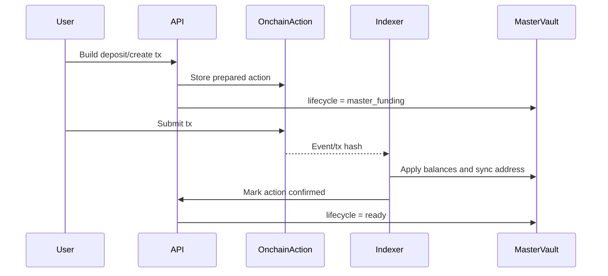
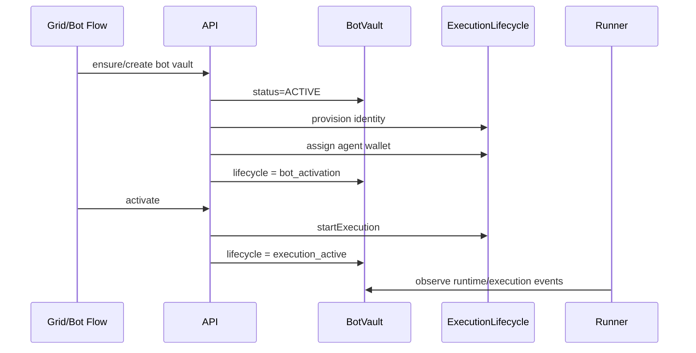
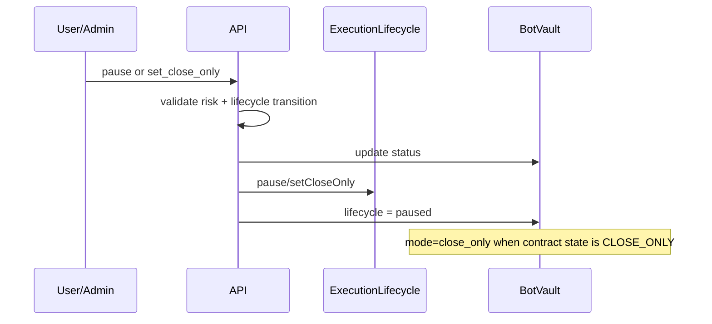
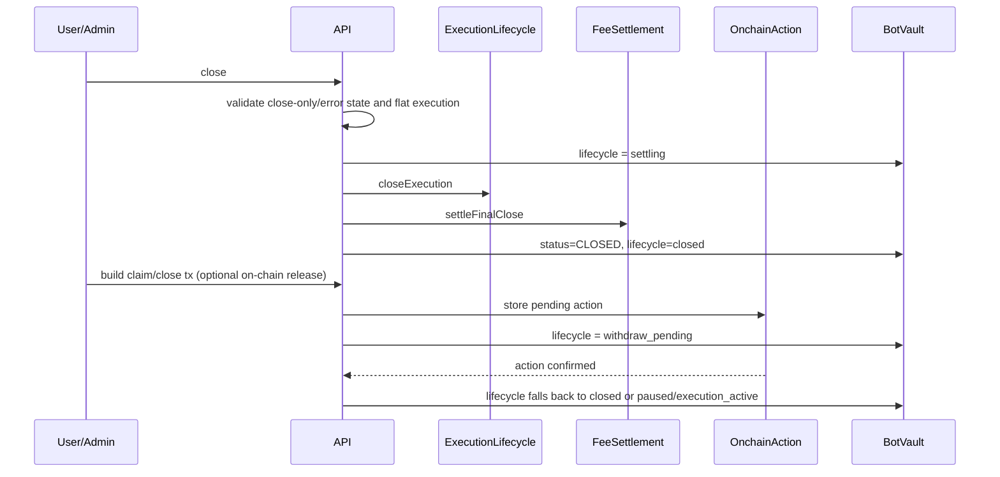

# Vault Lifecycle

uLiquid Desk now treats vault lifecycle as an explicit operational model layered on top of the existing persisted and on-chain fields.

## State Model

### MasterVault lifecycle states

- `master_funding`
  Active when a pending on-chain action exists for `create_master_vault` or `deposit_master_vault`.
- `withdraw_pending`
  Active when a pending on-chain action exists for `withdraw_master_vault`.
- `ready`
  Default steady state for an initialized master vault.
- `closed`
  Reserved terminal state if a master vault is ever explicitly closed.
- `error`
  Reserved operational fault state.

### BotVault lifecycle states

- `bot_creation`
  Vault creation is in progress or an on-chain `create_bot_vault` action is still pending.
- `bot_activation`
  Vault exists and execution identity is provisioned, but execution is not yet running.
- `execution_active`
  Vault is active and execution is running.
- `paused`
  Vault is paused or in contract `CLOSE_ONLY`; the lifecycle exposes `mode=close_only` to keep that distinction explicit.
- `settling`
  Explicit close workflow is in progress after validation, before terminal close finalization.
- `withdraw_pending`
  A pending on-chain `claim_from_bot_vault` or `close_bot_vault` action exists.
- `closed`
  Terminal state.
- `error`
  Execution or lifecycle error that needs operator attention.

## Contract Mapping

- `BotVault.status` remains the contract-compatible source of truth for `ACTIVE`, `PAUSED`, `CLOSE_ONLY`, `CLOSED`, and `ERROR`.
- `BotVault.executionStatus` remains the execution runtime source of truth for `created`, `running`, `paused`, `close_only`, `closed`, and `error`.
- `executionMetadata.lifecycle` now stores the normalized operational lifecycle snapshot.
- `executionMetadata.lifecycleOverrideState=settling` is used only for the explicit close window.
- Pending on-chain actions overlay `master_funding` and `withdraw_pending` without changing runtime-safe persisted enums.

## Transition Rules

### BotVault lifecycle transition matrix

- `bot_creation -> bot_activation | paused | error`
- `bot_activation -> execution_active | paused | settling | withdraw_pending | error`
- `execution_active -> paused | settling | withdraw_pending | error`
- `paused -> bot_activation | execution_active | settling | withdraw_pending | closed | error`
- `settling -> withdraw_pending | closed | error`
- `withdraw_pending -> execution_active | paused | closed | error`
- `error -> paused | settling | closed`
- `closed -> terminal`

Lifecycle transitions are enforced in API services before status mutations. Contract-state transitions are still validated by `riskPolicyService.assertStatusTransition(...)`.

## Validation And Audit

- `pause`, `activate`, `set_close_only`, and `close` now validate both:
  persisted status transition safety
  operational lifecycle transition safety
- Each successful transition emits `vault_lifecycle_transition`.
- Rejected transitions emit `vault_lifecycle_transition_rejected`.
- Execution-side changes still emit `botExecutionEvent` rows for provider/runtime observability.
- `close` now emits an explicit transition into `settling` before final settlement and terminal close.

## Failure Handling

- `activate` still validates template risk constraints before execution start.
- `close` still blocks on active execution or open positions unless `forceClose=true`.
- Failed execution sync or provider failures continue to surface through `executionLastError`, `executionStatus=error`, and execution events.
- On-chain reconciliation normalizes `STOPPED` to `PAUSED` before comparing with contract state to avoid false drift.

## Admin And Ops Support

New admin support lives under `/admin/vault-ops`:

- `GET /admin/vault-ops/bot-vaults/:id`
  Returns the normalized lifecycle snapshot for a specific bot vault.
- `POST /admin/vault-ops/bot-vaults/:id/intervene`
  Supports `sync_execution_state`, `pause`, `activate`, `set_close_only`, and `close`.

`/admin/vault-ops/status` now also exposes derived `lifecycleState` and `lifecycleMode` for recent execution issues and lagging vaults.

## Sequence Diagrams

### Master vault funding

### Bot vault creation and activation

### Pause and close-only

### Close, settle, withdraw pending, closed

